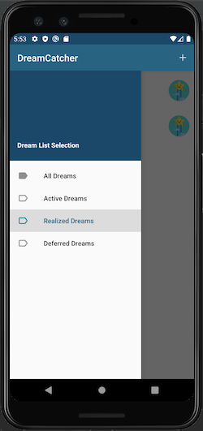

# Dream Logger

An Android Application built using Kotlin

The Dream Logger appl allows users to log, track and update their dreams on a single platform.

Features:

- Add new dreams by clicking on the add button on the top left of the list view.
- Add a dream description and picture
- Share your dreams with others
- Add new comments
- Update the status of the dreams, Realized or Deferred

     
# Dream-Log
# Dream-Log
